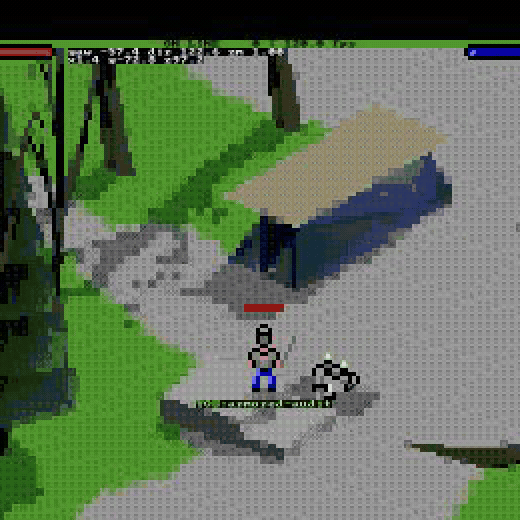

# Asciicker Historical Runtime

This private standalone repository is the full pre-FL-4512 C++ Asciicker
runtime from the Block Feature candidate lineage, with the final normalized-XP
layer contract and bundle-based actor appearance cutover integrated into that
runtime. It is a game repository: native terminal client, authoritative server,
browser/WebAssembly client, maps, meshes, audio, sprites, and the normalized
appearance compiler/runtime owners are all included.

It is not an XP parser, corpus browser, two-file historical loader, or
documentation snapshot.

The GIF is a six-second recording of the real browser build connected to the
real authoritative server. The player picked up the map-owned helmet (definition
410), armor (411), and sword (409) through ordinary gameplay input; the server
reported them equipped in slots 301, 306, and 303. The armored composite then
moves and turns beside the placeable blocks. No synthetic TUI or command-entry
sequence is used as product proof.

## Run the browser game

Requirements: Python 3.11+, a C++20 compiler, Emscripten 4.0.21, and the native
audio development library for the server (libpulse-dev on Linux; Apple audio
frameworks are supplied by macOS). The macOS terminal client additionally
requires Homebrew V8 (`brew install v8`).

In one terminal:

~~~sh
make -j4 -f makefile_server
./.run/server
~~~

In another:

~~~sh
./build-web.sh
python3 -m http.server 8765 --directory .web
~~~

Open http://127.0.0.1:8765/, enter a name and
ws://127.0.0.1:8080, then select **Play**.

## Run the terminal client

~~~sh
make -j4 -f makefile_game_term_mac   # macOS
./.run/game_term
~~~

The verified standalone terminal path is macOS. The historical Linux makefile
requires a separately provisioned V8 monolith at
`vendor/v8/v8/out.gn/x64.release/obj/libv8_monolith.a`; it is not a
clean-checkout Linux target. The authoritative server and browser targets are
verified on Linux in CI.

## Verify the integrated contracts

~~~sh
python3 -m pip install -r requirements-test.txt
./scripts/run_standalone_checks.sh
~~~

That command runs 25 collected pytest cases, five standalone Python contract
checks, three JavaScript tests, and four currentness or isolation gates. The
native server and terminal client are separate build acceptance surfaces; the
browser build additionally runs the glyph-manifest and actor-visual coverage
gates before compiling.

See [attribution and exact source identities](docs/ATTRIBUTION.md), the
[player guide](docs/player-guide.md), and the chronological
[failure log](docs/FAILURE_LOG.md).
