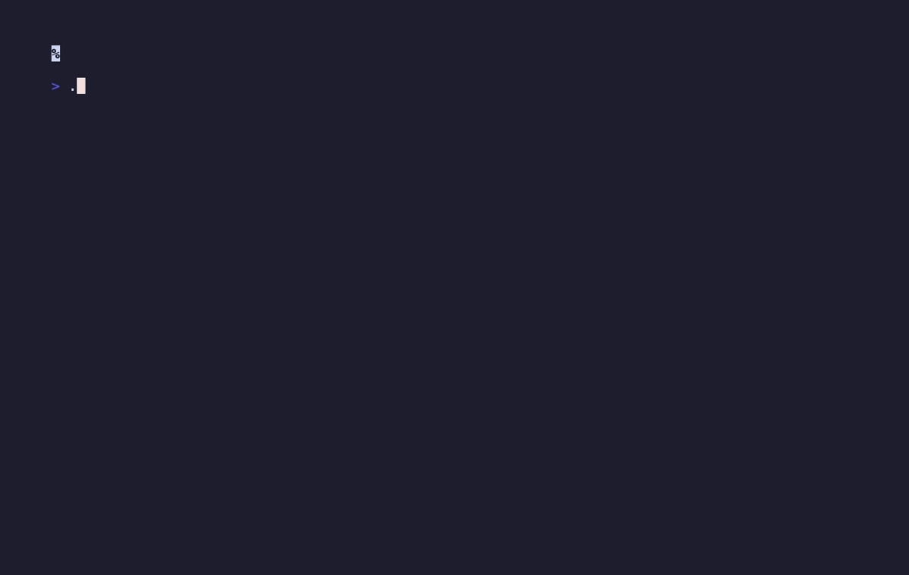

# Historical Asciicker XP Runtime

A clean-build C++ terminal adapter for the historical Asciicker REXPaint XP
loading contract at commit `0bdb614c77e9b06ee47af7b4ff1d584ada4793a1`, paired
with the completed 115-file normalized-XP snapshot.



## Build and run

Requirements: a C++20 compiler and zlib.

```sh
./build.sh
./run-runtime.sh
```

Controls: `j`/`k` change raw layer, `h`/`l` change angle, `n`/`p` change
frame, `a` changes animation, and `q` exits. Deterministic checks:

```sh
./run-runtime.sh --once
./run-runtime.sh --verify-corpus
```

The corpus verification parses all 115 bundled XP files through the C++ loader
and reports the total raw-layer count. It never writes into the snapshot.

## Product boundary

This is the reviewed minimal adapter/transplant, not the full historical game.
It preserves the historical runtime's gzip/REXPaint layer-loading contract and
exercises it against the later frozen normalized-XP corpus. It excludes the
FL-4512 renderer, gameplay, editor, server, research pipeline, agent material,
and the unsafe 267-commit interleaved range.

See [docs/ATTRIBUTION.md](docs/ATTRIBUTION.md) for exact source and snapshot
identities.
