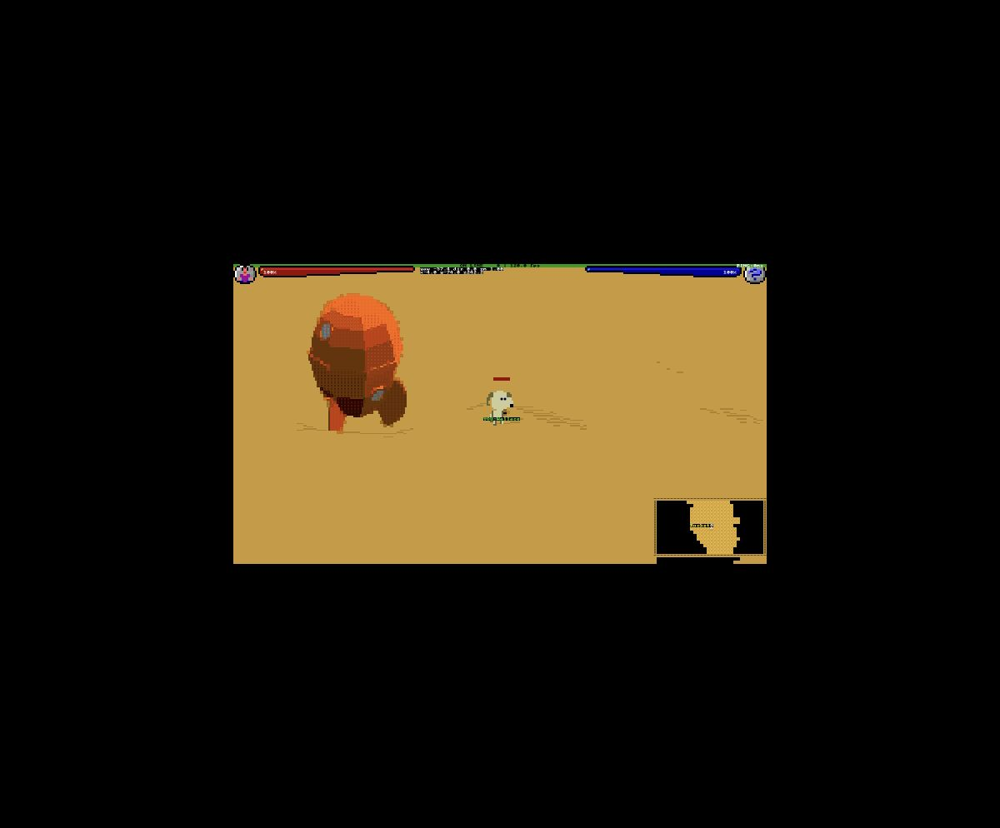
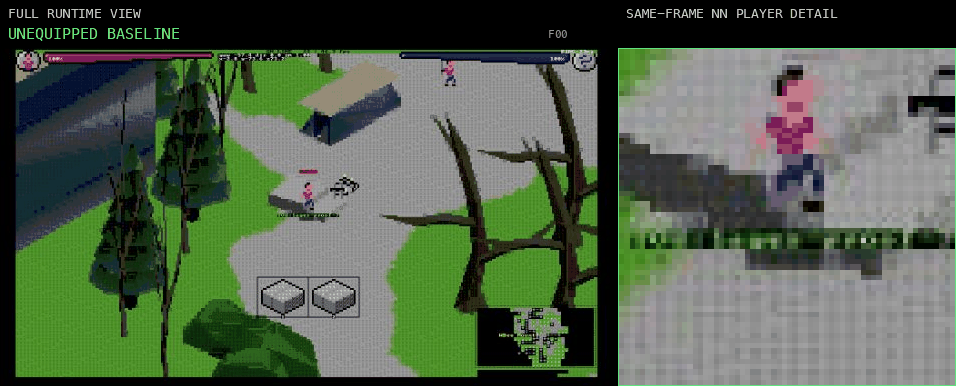

# Asciicker Y9-2 Runtime

A fork of [msokalski/asciicker](https://github.com/msokalski/asciicker), a CP437 3D ASCII engine.

This repository contains the full playable C++ runtime used by the Y9-2 branch: an authoritative server, native terminal client, browser/WebAssembly client, maps, meshes, audio, sprites, and the actor-appearance tooling used by the runtime.

The renderer keeps the original CP437 byte-cell path for glyph IDs `0..255`. Y9-2 also supports manifest-declared extended glyph IDs through separate sidecar data, so the current runtime is not limited to CP437 even though that remains its compatibility fast path.

## Current scene



The checked-in scene uses rolling yellow sand terrain, a player start, and a large upright rocket nearby. Wallace has a dedicated player appearance. The server creates Gromit as a player-owned companion that follows the player and is excluded from hostile and damage-target behavior.

The current tests pin the Wallace and Gromit sprite bytes, the rocket source and runtime mesh, the sand-map structure and rocket placement, and the server-owned companion relationship. The terrain has continued to change since the screenshot was captured, so the image above is an example of the scene rather than a pixel-exact claim about the latest map.

## Actor appearance



Actor appearance is compiled from normalized REXPaint `.xp` source layers into runtime profiles. The server selects reachable appearance state, while the client resolves the corresponding layered presentation. The bundled data includes base sprites as well as equipment layers such as armor, helmets, and weapons.

## Runtime layout

The repository has three main executable surfaces:

- **Authoritative server** — owns game-state simulation and multiplayer state.
- **Native terminal client** — runs the game in a terminal using the native renderer.
- **Browser client** — compiles the client to WebAssembly and connects to the same server over WebSocket.

The repository also includes the map and asset formats, actor-appearance compiler inputs and generated tables, glyph manifests and atlases, and standalone contract tests used by those runtime paths.

## Build

The top-level `Makefile` wraps the supported build commands:

```sh
make server
make terminal
make web
make test
```

The browser build uses Emscripten 4.0.21. The Linux server build needs PulseAudio development headers. The macOS terminal build uses Homebrew V8.

## Run

Start the server:

```sh
make server
make run-server
```

For the browser client, build and serve it in another terminal:

```sh
make web
make serve-web
```

Then open `http://127.0.0.1:8765/` and connect to `ws://127.0.0.1:8080`.

For the native terminal client:

```sh
make terminal
make run-terminal
```

The repository's GitHub Actions workflow is configured to run the standalone checks, build the server on Linux, build the terminal client on macOS, and build the WebAssembly client on Linux.

## Source and licensing

See [docs/ATTRIBUTION.md](docs/ATTRIBUTION.md) for upstream and Y9-2 source identities, asset provenance, and licensing information. The original Asciicker source license is preserved under `docs/licenses/`.

Historical development records are kept separately in [docs/FAILURE_LOG.md](docs/FAILURE_LOG.md).
